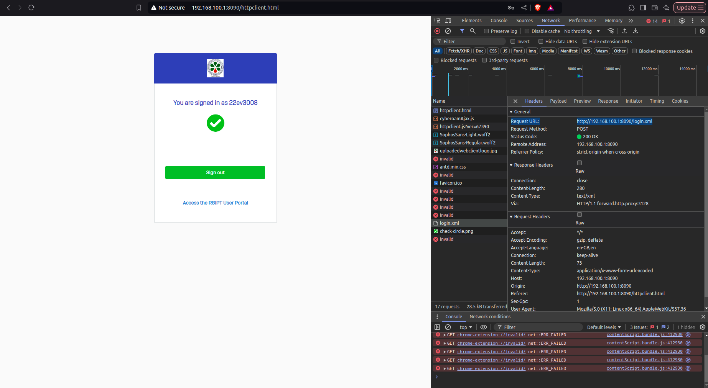
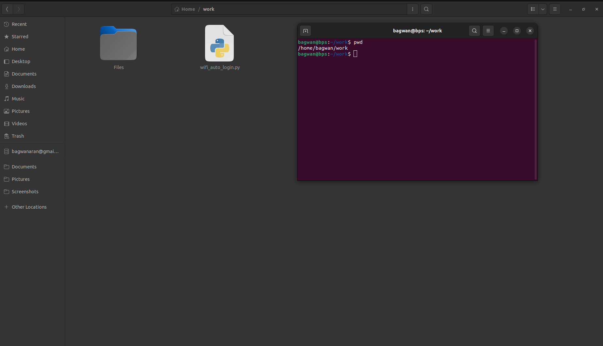
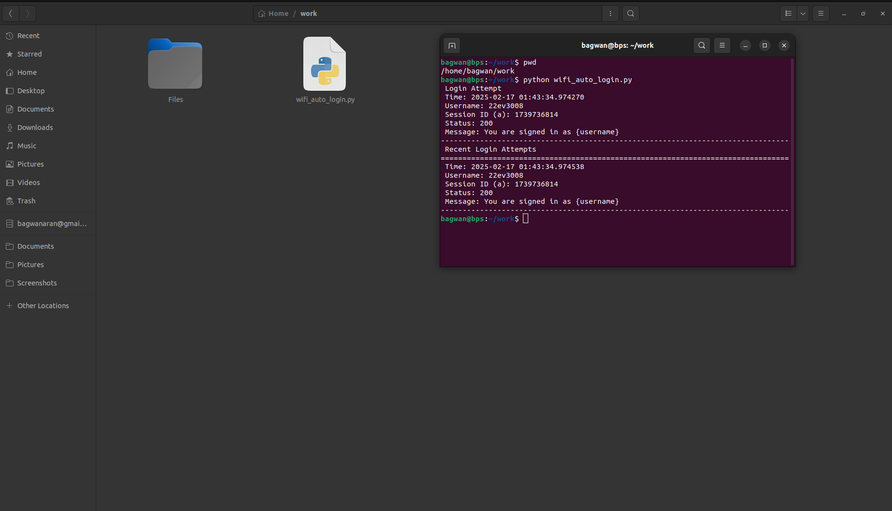
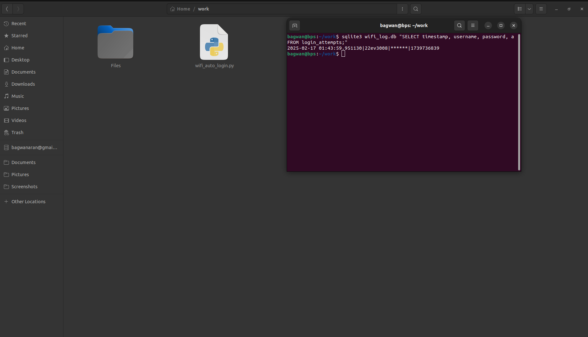
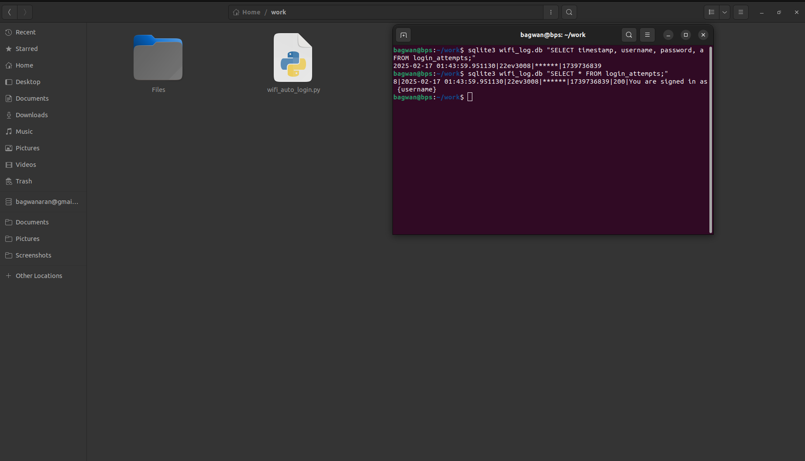

<link rel="stylesheet" href="style.css">

## Project Workflow: Step-by-Step Demonstration of WiFi Auto Login Project

This section provides a detailed walkthrough of how the WiFi Auto Login script functions, from inspecting the login process to executing the script and storing login attempts in SQLite. Each step is supported by screenshots to help visualize the process.

The demonstration covers:
- Identifying the correct POST URL and payload parameters using browser dev tools.
- Setting up the Python script in a chosen directory.
- Running the script to automate login.
- Storing login attempts securely in an SQLite database, including response details.
---
## Project Screenshots

### 🔹 1. Inspecting the Login Page
Opening the login page and using "Inspect Element" to analyze the request flow.

  

### 🔹 2. Manually login ito the Wifi and notice login.xml is created in the Network tab  
Once logged in manually, we can see the network request in the browser's Developer Tools.
 

### 🔹 3. check the Header Section Inside the login.xml file for POST url(i.e the Request URL) 
Extracting the correct request URL from the network request details.
  

### 🔹 4. check the Payload Section for all the Parameters
Identifying the parameters sent in the login request, which will be used in the script.

 

### 🔹 5. Place the wifi_auto_login.py file in any directory and check it's path
Locating the script to execute it from the terminal or command prompt.

 

### 🔹 6. Execute wifi_auto_login.py file
Running the script to perform an automated WiFi login.

 

### 🔹 7. Checking all Stored Payloads in SQLite:
Validating that login attempts are correctly recorded in the database.

 

### 🔹 8. Checking all all columns, including response_status and response_message in SQLite 
Ensuring that login attempts, along with responses, are logged in the database.

  

Note: Passwords should be masked with "******" for security. They can be reviewed in screenshots 7 and 8.

---
